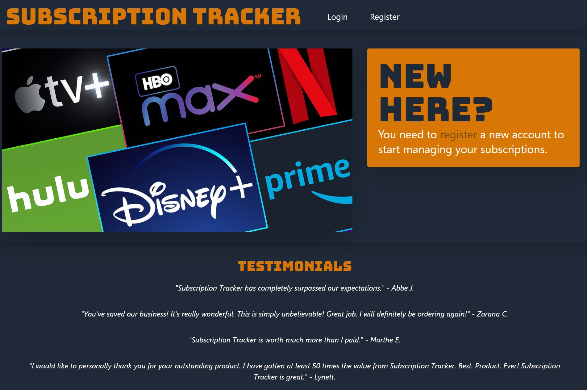
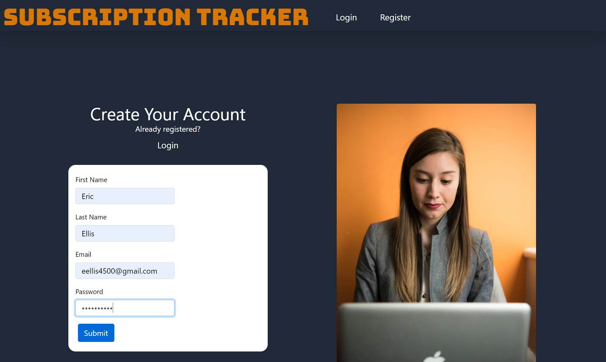
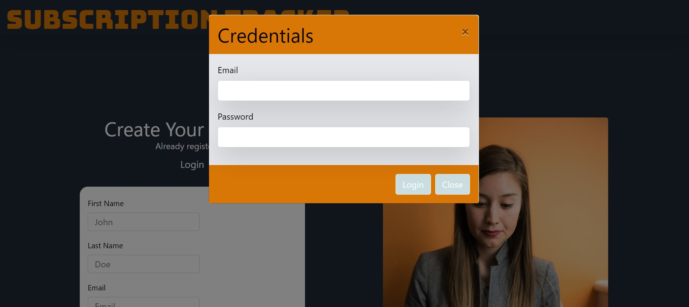
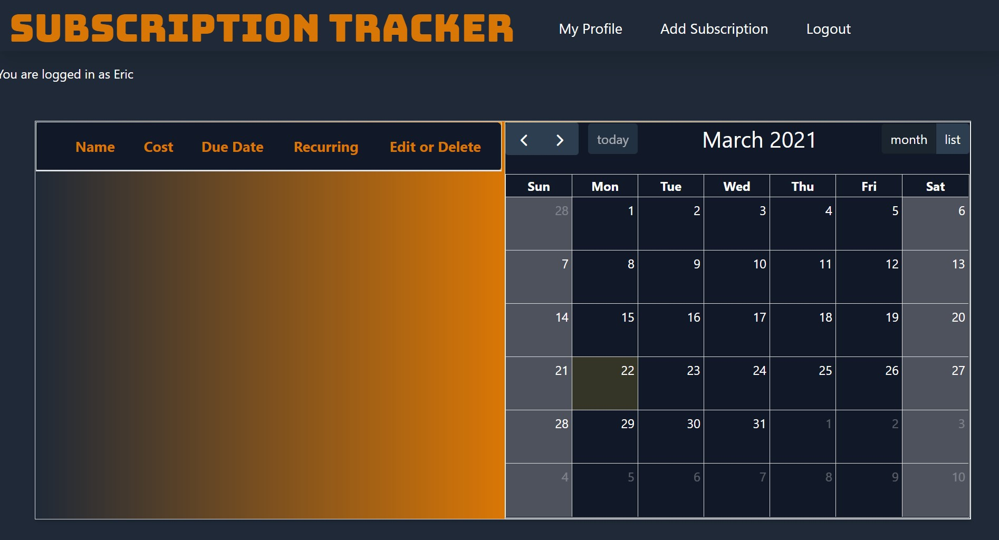
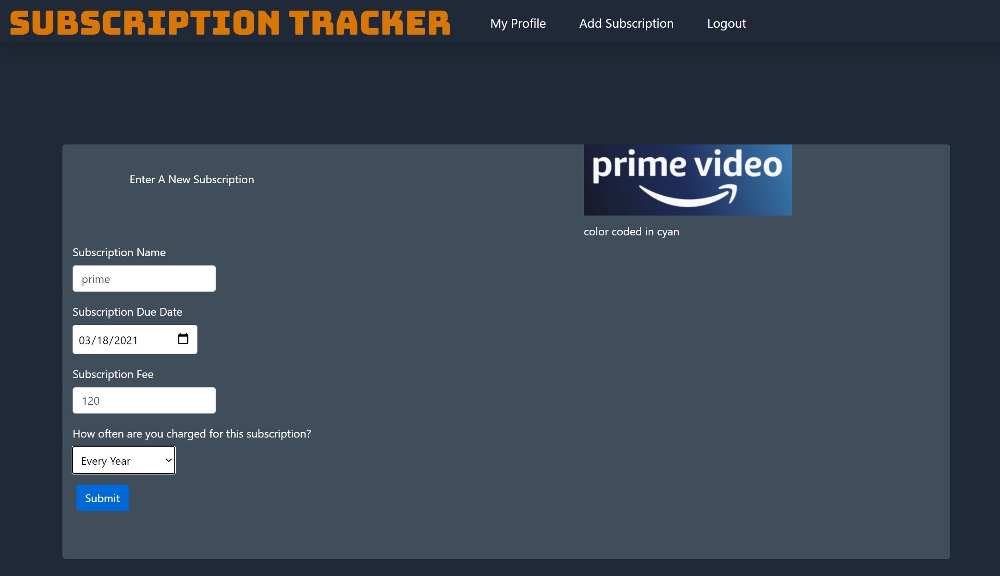
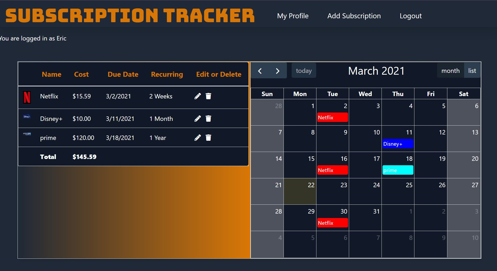

# Subscription-Tracker

[GitHub Commits](https://github.com/JaredWeaver/Subscription-Tracker/graphs/contributors)

Subscription-Tracker is a website that allows you to track the various recurring subscriptions in your life. It allows you to input all your subscriptions, the frequency with which they occur, provides a calendar layout so you can see when the subscriptions occur, and lets you track how much the subscriptions cost.

<a href = "https://subscription-trkr.herokuapp.com/">Here is a link to Subscription-Tracker</a>

## Using The Subscription Tracker

To use the subscription tracker, you will need to go to the main landing page (listed above), and click register if you are a first time user. Otherwise you can select to login where a pop up box will ask for your email and password. Selecting register will take you to the registration page where you create your account. You will now be at your profile page. Existing subscriptions that you already had will appear in this left side of the page (as they are stored by the application). The right hand side of the page will display subscriptions on the day in which they renew. The Add Subscription page will take you to the requisite page to make those changes. Some common subscriptions have been pre-loaded and will appear on your New Subscription page before you even hit submit. Other subscriptions will randomly generate a color. From your profile screen, you can click the pencil to edit your existing subscriptions at any time.

## Screenshots

    <!--  -->
<!-- 

 -->

## Contributors

- Jared Weaver (https://github.com/JaredWeaver)   
- Duy Nguyen (https://github.com/linosm)  
- Michel Nhouyvanisvong (https://github.com/nhounhou)  
- Stephen Wright (https://github.com/wrightsah)  
- Eric Ellis (https://github.com/eellis4500  

## Credits

The following resourses were used in the creation of this project:

APIs
- https://fullcalendar.io/
- https://tailwindcss.com/

### Other websites

- https://stackoverflow.com/
- https://www.w3schools.com/
- https://www.heroku.com/
- https://www.screentogif.com/
- https://github.com/

#### Other Trademarked Entities
Costco, Netflix, Hulu, Amazon Prime, Disney+

## License

This project uses the following license: MIT License Copyright(c) 2021
